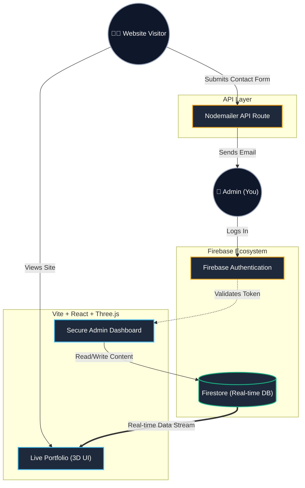

<div align="center">
  <br />
  <a href="https://github.com/meetukani34-prog/Portfolio" target="_blank">
    
  </a>
  <br />
  <br />

  <div>
    
    
    
    
    
  </div>

  <h3 align="center">Next-Gen 3D Developer Portfolio</h3>

  <p align="center">
    A highly immersive, dynamic, and interactive 3D web portfolio featuring a custom-built <b>Content Management System (Admin Panel)</b> powered by Firebase.
  </p>
</div>

---

## ⚡ Overview

Welcome to my personal portfolio repository! This project goes beyond a static website by integrating stunning **3D web graphics** (via Three.js and React Three Fiber) with a **real-time, fully functional Admin Dashboard**. 

Every piece of content—from the introductory text to the project showcases and service cards—can be edited, added, or deleted directly from the `/admin` route without ever touching a single line of code.

## 🏗️ System Architecture

The platform operates on a decoupled architecture, ensuring blazing-fast 3D rendering on the frontend while relying on Firebase for real-time backend synchronization.



## 🔋 Key Features

- 🌌 **Immersive 3D Experience:** Custom 3D avatars, interactive floating tech globes, and a dynamically generated starry background.
- 🔐 **Secure Admin Panel:** A beautifully crafted, protected dashboard to manage all portfolio data (Projects, Experiences, Testimonials, Social Links, etc.).
- ⚡ **Real-time Synchronization:** Powered by Firestore, changes made in the admin panel are instantly reflected across the live site.
- 🛡️ **Zero-Downtime Fallbacks:** Intelligent hooks that seamlessly switch to local constants if the database connection drops.
- 📱 **Fully Responsive:** Meticulously designed with Tailwind CSS to ensure a flawless experience across desktops, tablets, and smartphones.
- 🚀 **High Performance:** Built with Vite for lightning-fast HMR and optimized production builds.

## 🛠️ Tech Stack

| Category | Technologies |
| :--- | :--- |
| **Frontend Core** | React.js, Vite, HTML5, Vanilla CSS |
| **Styling & Animation** | Tailwind CSS, Framer Motion, React Parallax Tilt |
| **3D Graphics** | Three.js, React Three Fiber (R3F), React Three Drei |
| **Backend & Database** | Firebase (Authentication, Firestore, Storage) |
| **Routing & Icons** | React Router DOM, React Icons |

---

## 🚀 Quick Start (Local Setup)

Want to run this project locally and explore the Admin Panel? Follow these steps:

### 1. Prerequisites
Ensure you have [Node.js](https://nodejs.org/) (v16+) and Git installed on your machine.

### 2. Clone the Repository
```bash
git clone https://github.com/meetukani34-prog/Portfolio.git
cd Portfolio
```

### 3. Install Dependencies
```bash
npm install
```

### 4. Firebase Configuration
To use the Admin Panel, you need your own Firebase project:
1. Go to the [Firebase Console](https://console.firebase.google.com/) and create a new project.
2. Enable **Authentication** (Email/Password) and create an Admin user.
3. Enable **Firestore Database** (Start in Test Mode).
4. Create a `.env` file in the root directory based on `.env.example` (or copy the format below) and add your Firebase credentials.

```env
VITE_FIREBASE_API_KEY=your_api_key
VITE_FIREBASE_AUTH_DOMAIN=your_project.firebaseapp.com
VITE_FIREBASE_PROJECT_ID=your_project_id
VITE_FIREBASE_STORAGE_BUCKET=your_project.firebasestorage.app
VITE_FIREBASE_MESSAGING_SENDER_ID=your_sender_id
VITE_FIREBASE_APP_ID=your_app_id
```

### 5. Seed Initial Data (One-Time Only)
Start the development server:
```bash
npm run dev
```
Open `http://localhost:5173`. Open your browser's Developer Console (F12) and run the following command to migrate the hardcoded data into your new Firestore database:
```javascript
import('/src/utils/seedFirestore.js').then(m => m.seedAllData())
```

### 6. Access the Admin Panel
Navigate to `http://localhost:5173/admin` and log in with your Firebase Authentication credentials to start managing your site!

---

## 📁 Directory Structure

```text
📦 src
 ┣ 📂 admin            # Secure CMS Dashboard & Data Editors
 ┣ 📂 assets           # Images, 3D Models, and static assets
 ┣ 📂 components       # Reusable UI sections (Hero, About, Works, etc.)
 ┃ ┗ 📂 canvas         # Three.js 3D Components (Avatar, Earth, Stars)
 ┣ 📂 constants        # Fallback local data 
 ┣ 📂 context          # React Context (AuthContext)
 ┣ 📂 hooks            # Custom Firestore real-time data hooks
 ┣ 📂 utils            # Motion utilities and Firebase seed scripts
 ┣ 📜 App.jsx          # Main application routing
 ┣ 📜 firebase.js      # Firebase SDK initialization
 ┗ 📜 index.css        # Global CSS and Tailwind directives
```

## 🌐 Deployment

This project is optimized for deployment on **Vercel** or **Netlify**.
1. Push your repository to GitHub.
2. Connect the repository to Vercel/Netlify.
3. Ensure you add your `.env` variables in the deployment platform's environment settings.
4. Deploy! (Vite will handle the `npm run build` process automatically).

---

<div align="center">
  <p><i>Code is poetry, AI is the canvas. Built with passion by Meet Ukani.</i></p>
</div>
