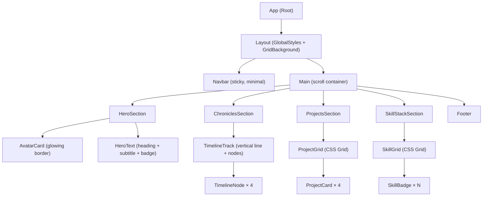
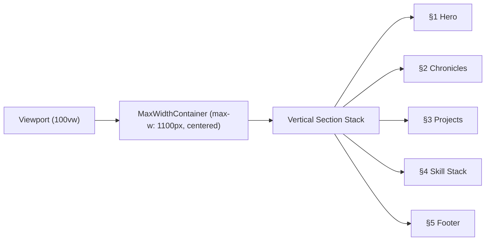
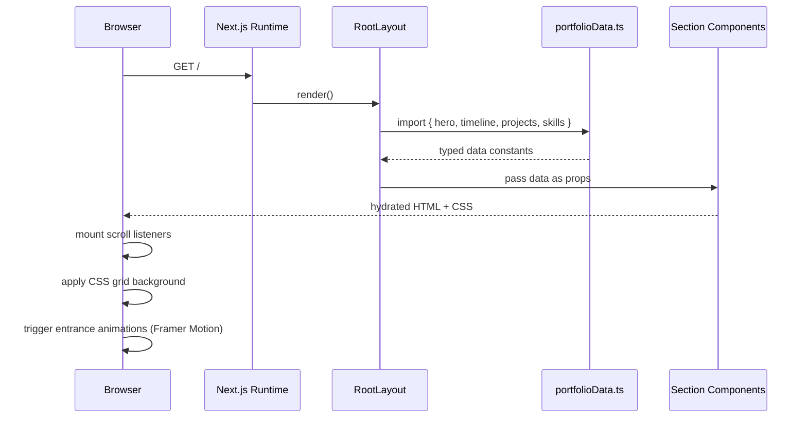
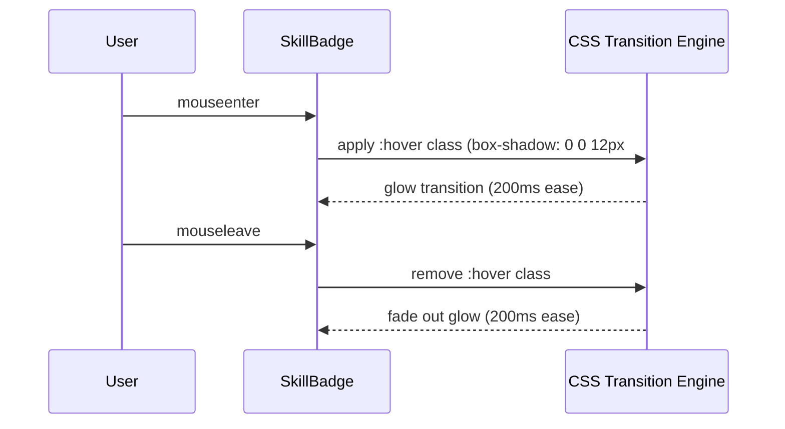

# Design Document: meet-portfolio

## Overview

A sophisticated, single-page personal portfolio website for **Meet**, a Full-Stack Developer & AI Enthusiast from India. The site is a monochromatic, dark-themed UI built with React/Next.js and TypeScript, featuring a pure black background (`#000000`), dark charcoal card surfaces (`#161b22`), and a clean blue accent system. The design is inspired by the structure of redoyanulhaque.me and communicates technical depth, professional credibility, and personal narrative through five distinct sections: Hero/About, Chronicles Timeline, Featured Projects, Skill Stack, and a Footer.

The portfolio is a static single-page application (SPA) with no backend — all data is co-located as typed constants. Subtle geometric grid lines are rendered via CSS background patterns on the root canvas. Typography uses Geist Sans (or Inter as fallback) for a clean, modern developer aesthetic.

---

## Architecture

### High-Level Component Tree



### Page Layout Flow



---

## Sequence Diagrams

### Page Load & Render Flow



### User Interaction: Hover on SkillBadge



---

## Components and Interfaces

### Component 1: `HeroSection`

**Purpose**: Top-of-page section combining the avatar, heading, subtitle, and status badge.

**Interface**:
```typescript
interface HeroProps {
  name: string                  // "Meet"
  heading: string               // "Meet: Turning Code into Conversational Intelligence."
  subtitle: string              // "Full-Stack AI Engineer | VTU, Bangalore."
  currentProject: string        // "The Next-Gen Exam Portal"
  avatarSrc: string             // path to profile image
  avatarAlt: string
}
```

**Responsibilities**:
- Render a circular avatar with a glowing blue border (`box-shadow: 0 0 0 3px #3b82f6, 0 0 24px #3b82f680`)
- Display bold heading and muted subtitle to the right of the avatar
- Render a small pill badge: `"Currently building: {currentProject}"`
- Animate in on mount (fade + slide-up via Framer Motion)

**Layout**:
```
[ Avatar (left, 160px circle) ]  [ HeroText (right, flex-col) ]
                                   [ H1: heading ]
                                   [ p: subtitle ]
                                   [ Badge ]
```

---

### Component 2: `ChroniclesSection`

**Purpose**: Vertical timeline of Meet's learning journey, titled "Chronicles."

**Interface**:
```typescript
interface TimelineEntry {
  year: string        // e.g. "2023"
  description: string // e.g. "Fundamentals & C/C++"
}

interface ChroniclesProps {
  entries: TimelineEntry[]
}
```

**Responsibilities**:
- Render a vertical track (2px wide, `#3b82f640` color) with glowing blue dot nodes
- Each node is a 10px circle (`background: #3b82f6`, `box-shadow: 0 0 8px #3b82f6`)
- Display year in bold off-white, description in muted gray
- Animate nodes in sequentially (staggered entrance)

**Layout**:
```
Chronicles
│
●── 2023: Fundamentals & C/C++
│
●── 2024: Mastering React, Node.js, & Hackathons
│
●── 2025: AI Integration, NLP Research
│
●── 2026: Engineering Degree at VTU & Building Intelligent Systems
```

---

### Component 3: `ProjectsSection`

**Purpose**: Grid of featured project cards.

**Interface**:
```typescript
interface TechTag {
  label: string   // e.g. "React"
  color?: string  // optional override, defaults to blue
}

interface Project {
  id: string
  title: string
  description: string
  tags: TechTag[]
  href?: string   // optional link to repo/demo
}

interface ProjectsProps {
  projects: Project[]
}
```

**Responsibilities**:
- Render a 2-column CSS grid (responsive: 1-col on mobile)
- Each `ProjectCard` has: title, description, tech tag pills
- Card border: `1px solid #30363d` (no heavy shadows)
- Card background: `#161b22`
- Tags rendered as small rounded pills with `#3b82f620` background and `#3b82f6` text

---

### Component 4: `ProjectCard`

**Purpose**: Individual project display card.

**Interface**:
```typescript
interface ProjectCardProps {
  project: Project
}
```

**Responsibilities**:
- Render title in bold off-white (`#e6edf3`)
- Render description in muted gray (`#8b949e`)
- Render tech tags as pill badges
- Subtle hover: border color shifts to `#3b82f660`
- Transition: `border-color 200ms ease`

---

### Component 5: `SkillStackSection`

**Purpose**: Categorized grid of technology skill badges.

**Interface**:
```typescript
interface SkillCategory {
  category: string    // e.g. "Frontend", "AI/ML", "Languages"
  skills: string[]    // e.g. ["React", "Tailwind CSS", "Next.js"]
}

interface SkillStackProps {
  categories: SkillCategory[]
}
```

**Responsibilities**:
- Render category label in small uppercase muted text
- Render skills as rounded badge chips in a flex-wrap row
- Each badge: `background: #161b22`, `border: 1px solid #30363d`, `color: #8b949e`
- Hover: `box-shadow: 0 0 12px #3b82f6`, `border-color: #3b82f6`, `color: #e6edf3`
- Transition: `all 200ms ease`

---

### Component 6: `GridBackground`

**Purpose**: Renders the subtle geometric grid lines on the page background.

**Interface**:
```typescript
interface GridBackgroundProps {
  gridSize?: number       // default: 40 (px)
  lineColor?: string      // default: "#ffffff08"
}
```

**Responsibilities**:
- Applied as a fixed full-viewport pseudo-element or CSS background on `body`
- Uses `background-image: linear-gradient(...)` pattern to draw grid lines
- Does not interfere with scroll or pointer events (`pointer-events: none`)

---

## Data Models

### `portfolioData.ts` — Static Data Layer

```typescript
// src/data/portfolioData.ts

export const heroData: HeroProps = {
  name: "Meet",
  heading: "Meet: Turning Code into Conversational Intelligence.",
  subtitle: "Full-Stack AI Engineer | VTU, Bangalore.",
  currentProject: "The Next-Gen Exam Portal",
  avatarSrc: "/images/meet-avatar.png",
  avatarAlt: "Meet — Full-Stack Developer & AI Enthusiast",
}

export const timelineData: TimelineEntry[] = [
  { year: "2023", description: "Fundamentals & C/C++" },
  { year: "2024", description: "Mastering React, Node.js, & Hackathons" },
  { year: "2025", description: "AI Integration, NLP Research" },
  { year: "2026", description: "Engineering Degree at VTU & Building Intelligent Systems" },
]

export const projectsData: Project[] = [
  {
    id: "sarvam",
    title: "Sarvam",
    description: "Universal Health QR system for seamless patient record access across healthcare providers.",
    tags: [{ label: "React" }, { label: "Python" }, { label: "Supabase" }],
  },
  {
    id: "exam-portal",
    title: "Exam Portal",
    description: "AI-powered proctoring system with real-time anomaly detection for online examinations.",
    tags: [{ label: "Next.js" }, { label: "FastAPI" }],
  },
  {
    id: "stitch",
    title: "Stitch",
    description: "AI Resume Analyzer using NLP to match candidate profiles against job descriptions.",
    tags: [{ label: "NLP" }, { label: "Python" }],
  },
  {
    id: "redxchess",
    title: "RedxChess",
    description: "Custom AI chess engine with minimax algorithm and alpha-beta pruning.",
    tags: [{ label: "C++" }, { label: "AI Engine" }],
  },
]

export const skillsData: SkillCategory[] = [
  {
    category: "Frontend",
    skills: ["React", "Next.js", "Tailwind CSS", "TypeScript"],
  },
  {
    category: "Backend",
    skills: ["Node.js", "FastAPI", "Python", "Supabase"],
  },
  {
    category: "AI / ML",
    skills: ["TensorFlow", "NLP", "LangChain", "OpenAI API"],
  },
  {
    category: "Languages",
    skills: ["TypeScript", "Python", "C++", "C"],
  },
]
```

**Validation Rules**:
- `heroData.heading` must be non-empty string
- `timelineData` must have at least 1 entry; entries sorted ascending by `year`
- `projectsData` each entry must have `id`, `title`, `description`, and at least 1 tag
- `skillsData` each category must have at least 1 skill

---

## Algorithmic Pseudocode

### Main Render Algorithm

```pascal
ALGORITHM renderPortfolio(portfolioData)
INPUT: portfolioData containing hero, timeline, projects, skills
OUTPUT: rendered React component tree

BEGIN
  ASSERT portfolioData.hero IS NOT NULL
  ASSERT portfolioData.timeline.length > 0
  ASSERT portfolioData.projects.length > 0
  ASSERT portfolioData.skills.length > 0

  // Step 1: Apply global styles and grid background
  applyGlobalStyles(
    backgroundColor := "#000000",
    fontFamily := "Geist Sans, Inter, sans-serif",
    gridPattern := buildGridPattern(size := 40, color := "#ffffff08")
  )

  // Step 2: Render sections in order
  sections ← [
    HeroSection(portfolioData.hero),
    ChroniclesSection(portfolioData.timeline),
    ProjectsSection(portfolioData.projects),
    SkillStackSection(portfolioData.skills),
    Footer()
  ]

  FOR each section IN sections DO
    ASSERT section IS valid React element
    mountWithEntranceAnimation(section, delay := index * 100ms)
  END FOR

  RETURN <Layout>{sections}</Layout>
END
```

**Preconditions:**
- `portfolioData` is fully typed and non-null
- All image assets referenced in `heroData.avatarSrc` exist in `/public/images/`

**Postconditions:**
- All five sections are rendered in DOM order
- Entrance animations are staggered by 100ms per section
- Grid background is applied without blocking pointer events

**Loop Invariants:**
- Each section rendered so far is a valid, mounted React element
- Animation delay increases monotonically with index

---

### Timeline Node Render Algorithm

```pascal
ALGORITHM renderTimelineNodes(entries)
INPUT: entries — array of TimelineEntry
OUTPUT: array of positioned TimelineNode elements

BEGIN
  nodes ← []
  
  FOR i FROM 0 TO entries.length - 1 DO
    ASSERT entries[i].year IS non-empty string
    ASSERT entries[i].description IS non-empty string

    node ← TimelineNode(
      year        := entries[i].year,
      description := entries[i].description,
      isLast      := (i = entries.length - 1),
      animDelay   := i * 150ms
    )

    nodes.append(node)
  END FOR

  ASSERT nodes.length = entries.length

  RETURN nodes
END
```

**Preconditions:**
- `entries` is a non-empty array
- Each entry has `year` and `description` as non-empty strings

**Postconditions:**
- Returns exactly `entries.length` node elements
- Last node has `isLast = true` (hides the connecting line below it)
- Animation delays are staggered by 150ms

**Loop Invariants:**
- `nodes.length = i` at the start of each iteration
- All previously created nodes are valid React elements

---

### Skill Badge Hover State Algorithm

```pascal
ALGORITHM applySkillBadgeHover(badge, event)
INPUT: badge — DOM element, event — "enter" | "leave"
OUTPUT: updated CSS state on badge

BEGIN
  IF event = "enter" THEN
    badge.style.boxShadow    ← "0 0 12px #3b82f6"
    badge.style.borderColor  ← "#3b82f6"
    badge.style.color        ← "#e6edf3"
  ELSE IF event = "leave" THEN
    badge.style.boxShadow    ← "none"
    badge.style.borderColor  ← "#30363d"
    badge.style.color        ← "#8b949e"
  END IF

  ASSERT badge.style.transition = "all 200ms ease"
END
```

**Preconditions:**
- `badge` is a mounted DOM element with `transition: all 200ms ease` already set
- `event` is one of `"enter"` or `"leave"`

**Postconditions:**
- Badge visual state reflects hover/idle correctly
- Transition is smooth (200ms ease)
- No layout shift occurs (only color/shadow properties change)

---

## Key Functions with Formal Specifications

### `buildGridPattern(size, color): string`

```typescript
function buildGridPattern(size: number, color: string): string
```

**Preconditions:**
- `size` is a positive integer (typically 20–80)
- `color` is a valid CSS color string (hex, rgba, etc.)

**Postconditions:**
- Returns a valid CSS `background-image` value string
- The pattern produces a grid of lines spaced `size` pixels apart
- The returned string is safe to assign to `element.style.backgroundImage`

**Implementation sketch**:
```typescript
function buildGridPattern(size: number, color: string): string {
  return [
    `linear-gradient(to right, ${color} 1px, transparent 1px)`,
    `linear-gradient(to bottom, ${color} 1px, transparent 1px)`,
  ].join(", ")
  // backgroundSize: `${size}px ${size}px`
}
```

---

### `mountWithEntranceAnimation(element, delay): void`

```typescript
function mountWithEntranceAnimation(
  element: React.ReactElement,
  delay: number
): void
```

**Preconditions:**
- `element` is a valid React element
- `delay` is a non-negative number (milliseconds)

**Postconditions:**
- Element is wrapped in a Framer Motion `motion.div`
- Initial state: `{ opacity: 0, y: 24 }`
- Animate state: `{ opacity: 1, y: 0 }`
- Transition: `{ duration: 0.5, delay: delay / 1000, ease: "easeOut" }`

---

### `renderProjectCard(project): ReactElement`

```typescript
function renderProjectCard(project: Project): React.ReactElement
```

**Preconditions:**
- `project.id` is a non-empty unique string
- `project.title` is a non-empty string
- `project.tags` has at least one entry

**Postconditions:**
- Returns a card element with title, description, and tag pills
- Card has `border: 1px solid #30363d` and `background: #161b22`
- All tags are rendered as pill elements with correct label text
- No layout overflow occurs (description is clamped to 3 lines via CSS)

---

## Example Usage

```typescript
// src/app/page.tsx
import { heroData, timelineData, projectsData, skillsData } from "@/data/portfolioData"
import HeroSection from "@/components/HeroSection"
import ChroniclesSection from "@/components/ChroniclesSection"
import ProjectsSection from "@/components/ProjectsSection"
import SkillStackSection from "@/components/SkillStackSection"
import Footer from "@/components/Footer"

export default function Home() {
  return (
    <main className="min-h-screen bg-black font-geist">
      <HeroSection {...heroData} />
      <ChroniclesSection entries={timelineData} />
      <ProjectsSection projects={projectsData} />
      <SkillStackSection categories={skillsData} />
      <Footer />
    </main>
  )
}
```

```typescript
// Example: ProjectCard usage
<ProjectCard
  project={{
    id: "sarvam",
    title: "Sarvam",
    description: "Universal Health QR system for seamless patient record access.",
    tags: [{ label: "React" }, { label: "Python" }, { label: "Supabase" }],
  }}
/>
```

```typescript
// Example: SkillBadge with hover
<SkillBadge
  label="TensorFlow"
  onMouseEnter={() => applySkillBadgeHover(ref.current, "enter")}
  onMouseLeave={() => applySkillBadgeHover(ref.current, "leave")}
/>
```

---

## Correctness Properties

*A property is a characteristic or behavior that should hold true across all valid executions of a system — essentially, a formal statement about what the system should do. Properties serve as the bridge between human-readable specifications and machine-verifiable correctness guarantees.*

### Property 1: Every project card renders at least one tech tag

*For any* `Project` in `projectsData` where `project.tags.length ≥ 1`, the rendered `ProjectCard` SHALL contain at least one visible tech tag pill element — no project card is ever rendered without tags.

**Validates: Requirements 4.5, 7.5**

### Property 2: No blank timeline nodes

*For any* `TimelineEntry` in `timelineData`, both `entry.year` and `entry.description` are non-empty strings — the `ChroniclesSection` never renders an empty or partially blank `TimelineNode`.

**Validates: Requirements 3.4, 7.4**

### Property 3: No empty skill categories

*For any* `SkillCategory` in `skillsData` where `category.skills.length ≥ 1`, the rendered `SkillStackSection` SHALL contain at least one `SkillBadge` for that category — no category group is rendered with zero badges.

**Validates: Requirements 5.3, 7.6**

### Property 4: Consistent section order

*For any* valid `portfolioData`, the five sections (HeroSection, ChroniclesSection, ProjectsSection, SkillStackSection, Footer) are always rendered in that exact DOM order — the page structure is invariant regardless of data content.

**Validates: Requirements 1.1**

### Property 5: Grid background never blocks interactions

*For any* rendered state of the `GridBackground`, the element always has `pointer-events: none` applied — grid lines never intercept mouse or touch events intended for content elements.

**Validates: Requirements 6.3**

### Property 6: Avatar glow is always present

*For any* valid `heroData`, the `AvatarCard` container always has the blue glow `box-shadow: 0 0 0 3px #3b82f6, 0 0 24px #3b82f680` applied when rendered — the visual identity anchor of the hero section is never missing.

**Validates: Requirements 2.1**

### Property 7: Hover transitions are always pre-set

*For any* rendered `SkillBadge` or `ProjectCard`, the element has `transition: all 200ms ease` set in its base (non-hover) styles — hover state changes are always smooth with no jarring jumps.

**Validates: Requirements 5.7, 4.7**

### Property 8: Timeline node count matches data length

*For any* non-empty array of `TimelineEntry[]`, the `ChroniclesSection` renders exactly `entries.length` `TimelineNode` elements — no nodes are added or dropped during rendering.

**Validates: Requirements 3.1**

### Property 9: Project card count matches data length

*For any* non-empty array of `Project[]`, the `ProjectsSection` renders exactly `projects.length` `ProjectCard` elements — no cards are added or dropped during rendering.

**Validates: Requirements 4.1**

### Property 10: Skill badge count matches data

*For any* array of `SkillCategory[]`, the total number of rendered `SkillBadge` elements equals the sum of all `category.skills.length` values across all categories.

**Validates: Requirements 5.3**

### Property 11: buildGridPattern returns valid CSS for any positive size and color

*For any* positive integer `size` and valid CSS color string `color`, `buildGridPattern(size, color)` returns a non-empty string containing two `linear-gradient` calls — the function never returns an empty or malformed CSS value.

**Validates: Requirements 6.1, 6.5, 6.6**

### Property 12: Entrance animation delays increase monotonically

*For any* section index `i` in the range `[0, 4]`, the entrance animation delay applied to that section equals `i * 100ms` — delays are strictly monotonically increasing with section index.

**Validates: Requirements 8.1**

### Property 13: External links always have noopener noreferrer

*For any* `Project` with a non-empty `href`, the rendered anchor element SHALL have `rel="noopener noreferrer"` — no external project link is ever rendered without this security attribute.

**Validates: Requirements 4.8, 9.3, 10.5**

### Property 14: All images have non-empty alt text

*For any* rendered state of the App, every `` element in the DOM SHALL have a non-empty `alt` attribute — the portfolio is never rendered with missing image descriptions.

**Validates: Requirements 9.1**

### Property 15: HeroSection renders all hero data fields

*For any* valid `HeroProps`, the rendered `HeroSection` SHALL contain the `heading` text, the `subtitle` text, and a badge containing the `currentProject` text — no hero data field is silently dropped during rendering.

**Validates: Requirements 2.2, 2.3, 2.4**

---

## Error Handling

### Scenario 1: Missing Avatar Image

**Condition**: `heroData.avatarSrc` path does not resolve (404)
**Response**: `` element falls back to `avatarAlt` text; avatar circle still renders with glow border
**Recovery**: Add a CSS `background-color: #161b22` fallback on the avatar container so the circle shape is preserved

### Scenario 2: Empty Data Arrays

**Condition**: `projectsData` or `timelineData` is an empty array (misconfiguration)
**Response**: Section renders a fallback empty-state message: `"No entries found."`
**Recovery**: Guard each section with `if (data.length === 0) return <EmptyState />`

### Scenario 3: Font Load Failure

**Condition**: Geist Sans fails to load from CDN/local
**Response**: Browser falls back to `Inter, system-ui, sans-serif` via CSS font stack
**Recovery**: No action needed — fallback is defined in global CSS `font-family`

### Scenario 4: Framer Motion Not Available

**Condition**: `framer-motion` package missing or fails to import
**Response**: Wrap all `motion.*` usage in a try/catch or conditional; render static elements without animation
**Recovery**: Provide a `NoMotion` wrapper that renders children directly without animation props

---

## Testing Strategy

### Unit Testing Approach

Test each component in isolation using **Vitest** + **React Testing Library**.

Key test cases:
- `HeroSection` renders heading, subtitle, and badge text correctly
- `ChroniclesSection` renders exactly `timelineData.length` nodes
- `ProjectCard` renders title, description, and all tags
- `SkillStackSection` renders all categories and their skills
- `buildGridPattern` returns a valid CSS string for any positive `size`

### Property-Based Testing Approach

Use **fast-check** to verify data-driven rendering invariants.

**Property Test Library**: fast-check

Key properties:
- For any array of `TimelineEntry[]` with length ≥ 1, `renderTimelineNodes` returns exactly the same number of nodes
- For any `Project` with at least 1 tag, `renderProjectCard` renders at least 1 tag pill
- For any `size > 0` and valid `color`, `buildGridPattern` returns a non-empty string containing both `linear-gradient` calls
- For any `SkillCategory[]`, the total rendered badge count equals the sum of all `skills.length` values

### Integration Testing Approach

Use **Playwright** for end-to-end visual and interaction tests:
- Full page renders without console errors
- All five sections are visible in the viewport after scroll
- Hovering a `SkillBadge` applies the glow class within 250ms
- Page is accessible: all images have `alt` text, heading hierarchy is correct (h1 → h2 → h3)

---

## Performance Considerations

- **Static generation**: Use Next.js `export` (SSG) — no server runtime needed; all data is static
- **Image optimization**: Use `next/image` for the avatar with `priority` flag to avoid LCP penalty
- **Font loading**: Use `next/font/google` for Geist Sans with `display: swap` to prevent FOIT
- **Animation**: Framer Motion's `LazyMotion` + `domAnimation` feature bundle keeps JS payload minimal
- **CSS grid background**: Implemented via CSS `background-image` (no canvas, no JS) — zero runtime cost
- **Bundle size**: No heavy UI libraries; Tailwind CSS purges unused styles at build time

---

## Security Considerations

- **No user input**: Portfolio is fully static — no forms, no auth, no API calls — attack surface is minimal
- **External links**: Any project `href` links open with `rel="noopener noreferrer"` to prevent tab-napping
- **Content Security Policy**: Set CSP headers in `next.config.js` to restrict script sources to self
- **Image sources**: Avatar image is served from `/public` (same origin) — no cross-origin image risks
- **Dependency hygiene**: Pin all npm dependencies to exact versions; run `npm audit` in CI

---

## Dependencies

| Package | Version | Purpose |
|---|---|---|
| `next` | `^14.x` | React framework with SSG support |
| `react` | `^18.x` | UI component library |
| `typescript` | `^5.x` | Type safety |
| `tailwindcss` | `^3.x` | Utility-first CSS |
| `framer-motion` | `^11.x` | Entrance animations |
| `geist` | `^1.x` | Geist Sans font (Vercel) |
| `vitest` | `^1.x` | Unit test runner |
| `@testing-library/react` | `^14.x` | Component testing utilities |
| `fast-check` | `^3.x` | Property-based testing |
| `playwright` | `^1.x` | End-to-end browser testing |

---

## Visual Design Tokens

```typescript
// src/styles/tokens.ts

export const colors = {
  background:    "#000000",   // page background
  surface:       "#161b22",   // card / section background
  border:        "#30363d",   // default border
  borderHover:   "#3b82f6",   // blue border on hover
  accent:        "#3b82f6",   // primary blue accent
  accentGlow:    "#3b82f680", // blue glow (50% opacity)
  accentSubtle:  "#3b82f620", // blue tag background (12% opacity)
  textPrimary:   "#e6edf3",   // headings, bold text
  textSecondary: "#8b949e",   // descriptions, muted text
  textAccent:    "#3b82f6",   // tag labels, links
  gridLine:      "#ffffff08", // subtle grid lines (3% opacity)
} as const

export const spacing = {
  sectionGap:  "80px",
  cardPadding: "24px",
  gridGap:     "16px",
} as const

export const typography = {
  fontFamily: "'Geist Sans', 'Inter', system-ui, sans-serif",
  heroSize:   "clamp(1.75rem, 4vw, 2.5rem)",
  bodySize:   "0.9375rem",   // 15px
  tagSize:    "0.75rem",     // 12px
} as const

export const effects = {
  avatarGlow:  "0 0 0 3px #3b82f6, 0 0 24px #3b82f680",
  nodeGlow:    "0 0 8px #3b82f6",
  badgeHover:  "0 0 12px #3b82f6",
  transition:  "all 200ms ease",
} as const
```
